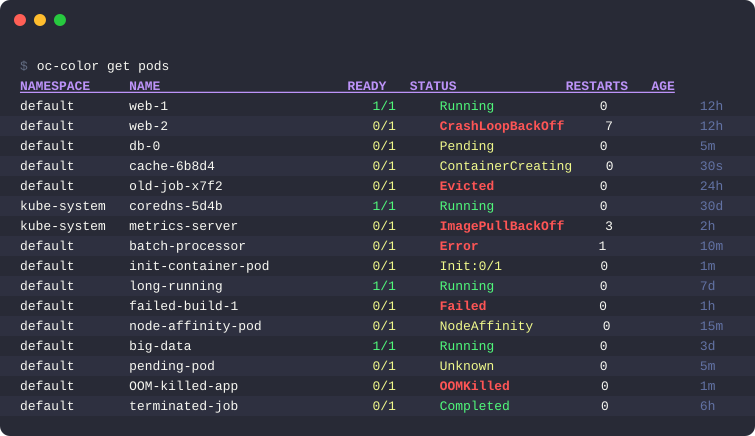
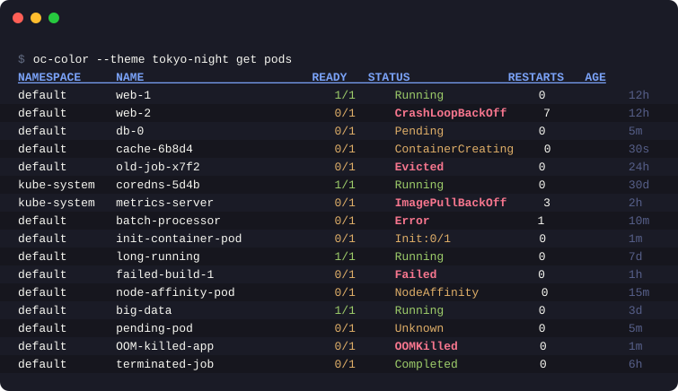

# oc-color

Colorize and syntax-highlight `oc` command output. Think `diff` → `colordiff`, but for `oc`.

[](https://go.dev)
[](/LICENSE)

<p align="center">
  
</p>

## Installation

### Krew plugin

Requires [krew](https://krew.sigs.k8s.io/) plugin manager. *Pending — krew submission not yet completed.*

```bash
kubectl krew install oc-color
```

### Go install

```bash
go install github.com/thephilip/oc-color@latest
```

### Build from source

```bash
git clone https://github.com/thephilip/oc-color.git
cd oc-color
go build -o oc-color .
cp oc-color ~/.local/bin/
```

## Quick start

```bash
oc color get pods
oc color get pods -o json
oc color describe pod my-pod
oc color --theme dracula get pods
oc color --dry-run

# Interactive theme picker with live preview
oc color themes

# Self-upgrade to latest version
oc color upgrade
```

## Features

| Feature | Description |
|---------|-------------|
| **Status colorization** | 35+ pod/build/deployment statuses colored by severity — `Running` in green, `CrashLoopBackOff` in bold red, `Pending` in yellow, etc. |
| **Table header styling** | Bold + underline + accent color on column headers |
| **Zebra-stripe shading** | Alternating row backgrounds for readability (toggle with `--no-shade`) |
| **Age/duration dimming** | Values like `12h`, `5m` rendered in a dim theme color |
| **JSON highlighting** | Built-in tokenizer (no dependencies) — keys, strings, numbers, booleans, null all colorized |
| **YAML highlighting** | Line-by-line tokenizer — document delimiters, keys, list markers, comments, and values highlighted |
| **Describe beautification** | Section headers, key-value pairs, event types (`Normal`/`Warning`), `<none>` dimming, `False` conditions highlighted |
| **Watch mode** | Colorized streaming watch with clean in-place terminal redraw — works with `--watch` or `oc`'s `-w` flag |
| **Theme system** | 7 built-in themes (catppuccin, dracula, gruvbox, nord, one-dark, solarized, tokyo-night). Custom YAML themes with `--theme`, `--list-themes`, `--validate-theme` |
| **Interactive theme picker** | `oc color themes` — TUI with arrow/vim navigation, live preview, and shade toggle. Saves to config |
| **Self-upgrade** | `oc color upgrade` — update to the latest version via `go install` |
| **TTY detection** | Auto-disable colors when piping. `--color=always\|never\|auto` flag |
| **Terminal capability detection** | Auto-detects truecolor/256/16-color support and degrades gracefully |
| **Dry-run mode** | `--dry-run` processes sample output to preview colors without a real cluster |

## Flags

| Flag | Description |
|------|-------------|
| `--color <mode>` | Color mode: `always`, `never`, `auto` (default: `auto`) |
| `--no-color` | Shorthand for `--color=never` |
| `--no-shade` | Disable zebra-stripe row shading |
| `--theme <name>` | Theme name (default: `dracula`) |
| `--list-themes` | List available themes |
| `--validate-theme <path>` | Validate a theme YAML file |
| `--watch` | Colorized watch mode with in-place terminal redraw |
| `--dry-run` | Process sample output to preview colors |
| `--version` | Print version |
| `--help`, `-h` | Show help |

## Subcommands

| Subcommand | Description |
|------------|-------------|
| `themes` | Interactive theme picker with live preview |
| `upgrade` | Self-upgrade to the latest version via `go install` |

## Configuration

Config file at `~/.config/oc-color/config.yaml` (or `$XDG_CONFIG_HOME/oc-color/config.yaml`):

```yaml
color: auto      # auto, always, never
theme: dracula   # theme name
shade: true      # set to false to disable zebra-stripe row shading
```

## Themes

7 built-in themes: **catppuccin**, **dracula** (default), **gruvbox**, **nord**, **one-dark**, **solarized**, **tokyo-night**.

<p align="center">
  
</p>

Custom themes go in `~/.config/oc-color/themes/<name>.yaml` (or `$XDG_CONFIG_HOME/oc-color/themes/<name>.yaml`).

### Theme file format

Supports string shorthand and structured YAML:

```yaml
name: nord
tokens:
  success: green
  warning: yellow
  error: bold+red
  info: cyan
  accent: "#5E81AC"
  dim: dim+white
  header: bold+underline+"#8FBCBB"
  key: "#88C0D0"
```

Required tokens: `success`, `warning`, `error`, `info`, `accent`, `dim`, `header`, `key`.

Validate a theme with:

```bash
oc color --validate-theme ~/.config/oc-color/themes/nord.yaml
```

## Examples

```bash
# Basic pod listing with colorized statuses
oc color get pods

# Force colors even when piping to less
oc color --color=always get pods | less -R

# JSON output with syntax highlighting
oc color get pod my-pod -o json

# YAML output with syntax highlighting
oc color get pod my-pod -o yaml

# Describe output beautification
oc color describe pod my-pod

# Colorized watch mode
oc color get pods -w

# Use a custom theme
oc color --theme nord get pods

# Interactive theme picker with live preview
oc color themes

# List available themes
oc color --list-themes

# Preview color output without a cluster
oc color --dry-run

# Self-upgrade to latest version
oc color upgrade
```

## Shell completions

`oc-color` is a transparent wrapper — it passes all arguments directly to `oc`. If you alias `oc=oc-color`, you want `oc`'s completions to keep working, not `oc-color`'s.

Tell your shell to use `oc`'s completion function for `oc-color`:

**zsh** — add after the alias in your `.zshrc`:

```zsh
alias oc=oc-color
compdef oc-color=oc
```

**bash** — add after loading `oc` completions in your `.bashrc`:

```bash
alias oc=oc-color
complete -F __start_oc oc-color
```

> The function name `__start_oc` is what `oc completion bash` registers. Verify with `complete -p oc` after loading completions.

**fish** — fish resolves completions via the aliased binary, so this usually works automatically when you alias `oc` to `oc-color`. If not, copy `oc`'s completion file:

```fish
cp $__fish_data_dir/vendor_completions.d/oc.fish ~/.config/fish/completions/oc-color.fish
```

## Development

```bash
go build -o oc-color .
go test ./...
```
